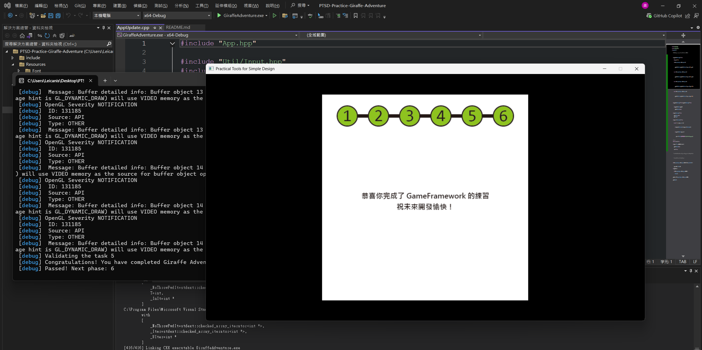

# Abstract

遊戲名稱：初代瑪利歐賽車復刻版 (Super Mario Kart Demake)

組員：

- 113820020 林政德

# Game Introduction

初代瑪利歐賽車復刻版是一款基於偽 3D (Mode 7) 技術的像素風競速遊戲。有別於傳統的 2D 俯視角，本遊戲將透過 OpenGL Shader 與 FBO (幀緩衝物件) 技術，將平面的賽道貼圖進行透視投影，重現超任 (SFC) 時代經典的地平線 3D 視覺效果。
玩家將駕駛卡丁車在賽道上奔馳，過程中需要精準控制車輛的轉向與速度，應對不同賽道材質（如草地減速）的物理回饋。地圖上散落著可收集的道具與障礙物，玩家必須熟悉賽道路線並善用道具，以最快速度完成圈數挑戰。

[遊戲參考連結](https://www.youtube.com/watch?v=6bZhnsyLAzI)

# Development timeline

- Week 02：環境建置、蒐集素材與前置處理
  - [ ] 完成專案 Proposal 撰寫
  - [ ] 設定 CMake 與 PTSD Framework 開發環境
  - [ ] 尋找並下載賽道、賽車、道具之像素貼圖 (Sprite Sheets)
  - [ ] 使用去背軟體將素材裁切並輸出為透明背景的 PNG 格式
- Week 03：實作 Mode 7 賽道渲染核心
  - [ ] 撰寫自定義的 Mode7.vert 與 Mode7.frag Shader
  - [ ] 在 Mode7Track 類別中實作 Raycasting 透視投影與紋理重複 (GL_REPEAT)
- Week 04：實作 FBO 像素化濾鏡
  - [ ] 建立 256x224 的低解析度 FBO (幀緩衝物件)
  - [ ] 實作 Render to Texture，並以 GL_NEAREST 放大至視窗，完成復古像素感
- Week 05：實作攝影機與玩家控制邏輯
  - [ ] 綁定鍵盤輸入 (Util::Input)，計算賽車前進向量與轉向角度 (Yaw)
  - [ ] 將運算結果同步至攝影機的 View 矩陣，達成場景轉動效果
- Week 06：實作賽車動態貼圖切換
  - [ ] 建立 PlayerKart 類別，繼承 Util::GameObject
  - [ ] 根據玩家的轉向操作，動態切換車輛的 2D 貼圖 (直行、左轉、右轉)
- Week 07：實作地形碰撞與物理回饋
  - [ ] 讀取賽道地形的 Color Map，判斷玩家目前所在的座標材質
  - [ ] 實作草地減速、撞牆反彈等基礎物理與邊界限制
- Week 08：期中 Demo 準備
  - [ ] 整合目前的渲染與車輛控制邏輯
  - [ ] 修復畫面破圖或 FBO 縮放造成的視覺 Bug
- Week 09：期中 Demo
  - [ ] 展示具備 Mode 7 透視與復古像素感的可駕駛賽道
  - [ ] 收集教授與同學的建議
- Week 10：賽道 Checkpoint 與圈數判定
  - [ ] 實作賽道沿線的隱形 Checkpoint 判定邏輯，防止抄捷徑作弊
  - [ ] 實作起跑線判定與單圈計時器 (Lap Timer)
- Week 11：實作電腦對手 (AI Racers)
  - [ ] 利用 Week 10 的 Checkpoint 作為導航路徑點 (Waypoints)
  - [ ] 實作 AI 基礎邏輯：計算目標角度並自動轉向與加速
  - [ ] 實作 2D Billboarding 讓 AI 車輛隨深度正確縮放與遮擋
- Week 12：道具與障礙物系統
  - [ ] 實作 ItemBox 隨機抽獎判定 (如：蘑菇加速、香蕉皮)
  - [ ] 在地圖配置障礙物，並實作玩家與 AI 踩到道具的狀態反饋
- Week 13：遊戲選單與 UI 系統
  - [ ] 實作 Title Screen (標題畫面) 與按鈕互動
  - [ ] 實作 Level Selection (賽道選擇介面) 與倒數起跑動畫 (3, 2, 1, GO!)
  - [ ] 使用 Util::Text 繪製遊戲中的時速表、名次與圈數 UI
- Week 14：狀態機整合與音效系統
  - [ ] 完善 Game State 管理：Title -> Menu -> Racing -> Result
  - [ ] 實作結算畫面，顯示玩家與 AI 的最終名次與完賽時間
  - [ ] 導入 Util::BGM (背景音樂) 與 Util::SFX (引擎聲、煞車、道具音效)
- Week 15：新增第二關卡與 AI 難度調整
  - [ ] 匯入全新的賽道貼圖、設定新賽道的碰撞邊界與路徑點
  - [ ] 實作「橡皮筋機制 (Rubber-banding)」：依據玩家名次動態微調 AI 的極速
- Week 16：整體效能優化與手感打磨
  - [ ] 微調玩家車輛的加速度、轉向靈敏度 (甩尾手感)
  - [ ] 檢查物件生命週期，確保程式穩定維持順暢的 FPS
- Week 17：期末驗收與提交
  - [ ] 拍攝遊戲實機遊玩展示影片
  - [ ] 製作遊戲期末簡報 (著重於 Mode 7 架構與 AI 導航邏輯)
  - [ ] 提交完整程式碼與二進位執行檔

# 長頸鹿大冒險通關證明 (you need)

