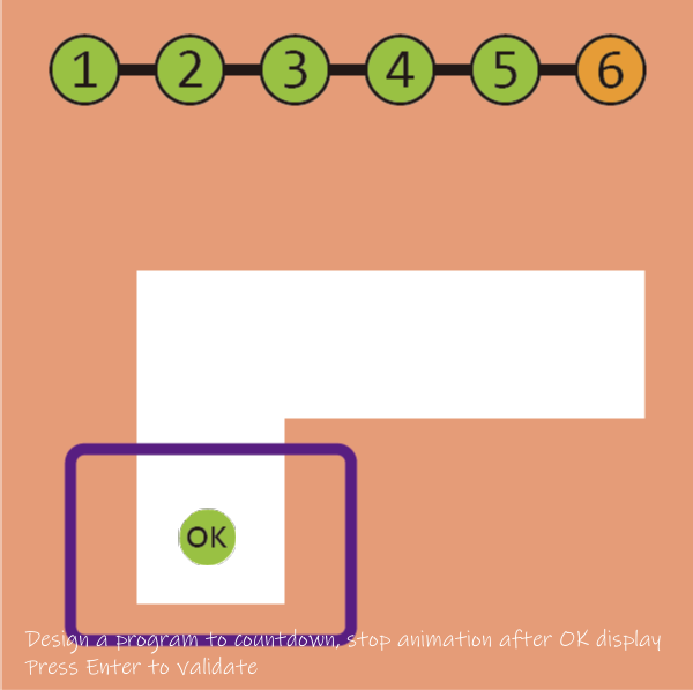

# Abstract

遊戲名稱：超級肉肉哥 Super Meat Boy

組員：

- 113AC1012 陳俊佑

# Game Introduction

《超級肉肉哥》以其精準細膩的操作手感和對時機把握的極高要求而著稱，設有超過300個富有挑戰性的關卡，另有更多玩家的自製關卡可供免費下載。玩家在遊戲中扮演一位顏色深紅，方方正正，猶如肉塊的「肉肉哥」（Meat Boy）。遊戲中的大反派「胎兒博士」（Dr.Fetus）綁架了肉肉哥的女朋友「繃帶妹」（Bandage Girl），玩家需要通過闖關來營救她。 

[遊戲連結](https://youtu.be/snaionoxjos?si=ESloz3greDftgajJ)

# Development timeline

- Week 02：撰寫 Proposal、完成練習

  - [ ] 確立《Super Meat Boy》核心機制（極致移動、滑牆、極速重生）的重現目標與系統架構設計。

  - [ ] 熟悉 ptsd-template 遊戲迴圈，完成視窗建立，並成功在畫面上渲染出一個可由鍵盤操控移動的紅色方塊（主角原型）。

- Week 03：蒐集素材

  - [ ] 尋找或繪製暫代美術素材（Placeholder），包含主角（肉肉男孩狀態圖）、靜態牆壁、致命陷阱（電鋸）、終點（繃帶女孩）。

  - [ ] 整理所需的遊戲音效與背景音樂素材（起跳聲、滑牆摩擦聲、死亡肉塊音效、過關音效）。

- Week 04：蒐集素材

  - [ ] 定義並微調物理引擎所需的各項核心常數（重力、最大下落速度、水平加速度、摩擦力、跳躍初速度）。

  - [ ] 規劃關卡資料格式，設計一套用來讀取 .txt 檔或二維陣列的解析器 (Parser)，作為後續生成關卡的基底。

- Week 05：製作地圖、過關動畫

  - [ ] 實作 Tilemap（網格地圖）渲染系統，將寫好的關卡資料陣列轉換成畫面上的磚塊與空間。

  - [ ] 撰寫碰到終點物件（繃帶女孩）的觸發邏輯，並實作簡單的過關切換場景動畫與延遲。

- Week 06：製作地圖、攝影機

  - [ ] 實作 AABB (Axis-Aligned Bounding Box) 碰撞檢測系統，徹底解決主角 X 軸與 Y 軸獨立移動時不穿透牆壁、不卡死的問題。

  - [ ] 實作簡單的攝影機追隨系統（Camera Follow），讓視角平滑地鎖定主角，並限制鏡頭不會超出關卡邊界。

- Week 07：製作怪物

  - [ ] 實作基礎靜態陷阱（如固定位置的旋轉電鋸、尖刺），並綁定主角的「死亡即刻重置」機制（不讀條，直接回到原點）。

  - [ ] 實作動態障礙物（例如設定路徑來回移動的電鋸），加上簡單的碰撞體跟隨邏輯。

- Week 08：製作怪物

  - [ ] 實作具備簡單追蹤邏輯的動態敵人（類似遊戲中會鎖定玩家的小蟲或自爆怪）。

  - [ ] 擴展玩家的狀態機 (State Machine)，加入完整的「滑牆 (Wall Slide)」與「牆壁跳 (Wall Jump)」的物理邏輯與動畫切換。

- Week 09：期中 Demo

  - [ ] 整合前面的所有系統，運用 Tilemap 排列出第一個具備起承轉合且可完整遊玩的測試關卡。

  - [ ] 進行內部測試，確保期中展示時核心的「移動、跳躍、滑牆、死亡重置」流程流暢且沒有閃退 Bug。

- Week 10：期中 Demo

  - [ ] 根據期中 Demo 的反饋，大幅微調物理手感（優化跳躍拋物線、加入土狼時間與輸入緩衝）。

  - [ ] 修復各類碰撞檢測的 Edge Case（例如高速落下時穿透地板、卡在兩個磚塊縫隙間等問題）。

- Week 11：製作角色

  - [ ] 將原有的單一角色邏輯抽離，建立「多角色切換系統」，實作擁有不同物理特性的解鎖客串角色（例如：浮空跳躍、二段跳）。

  - [ ] 若要忠於標題與專案趣味性，可為特定客串角色加入類似洛克人的「發射子彈 / 衝刺」機制，作為自創玩法的亮點。

- Week 12：製作角色

  - [ ] 為特殊客串角色設計專屬的碰撞體、狀態機切換與動畫邏輯。

  - [ ] 製作能與射擊 / 特殊能力互動的地圖機關（例如：只有子彈能打破的隱藏牆壁、衝刺才能穿越的雷射門）。

- Week 13：製作道具

  - [ ] 實作核心收集品系統（遊戲中的「繃帶」），碰觸後物件消失，並將數據記錄於跨關卡的全域變數中。

  - [ ] 實作 UI 介面，在畫面上實時顯示當前關卡的計時器與已獲得的繃帶數量。

- Week 14：製作道具

  - [ ] 實作進階的環境互動道具（例如：踩踏後會崩塌的平台、會把玩家強制彈飛的風扇或輸送帶）。

  - [ ] 撰寫解鎖判定邏輯，當玩家收集到特定數量的繃帶時，解鎖隱藏關卡或上述製作的特殊角色。

- Week 15：製作道具

  - [ ] 實作通關結算系統，根據過關的計時器判定玩家是否獲得「A+」評價，並解鎖該關卡的困難模式 (Dark World)。

  - [ ] 最終遊戲迴圈整合，包含主選單 (Main Menu)、關卡選擇畫面，並進行最後的專案打包與除錯。

- Week 16：Debug以及新增額外關卡

  - [ ] 最終專案除錯

  - [ ] 額外關卡新增

- Week 17：提交
  - [ ] 拍攝影片
  - [ ] 製作遊戲簡報
  - [ ] 驗收並提交

# OOP 修課證明 (if you need)

